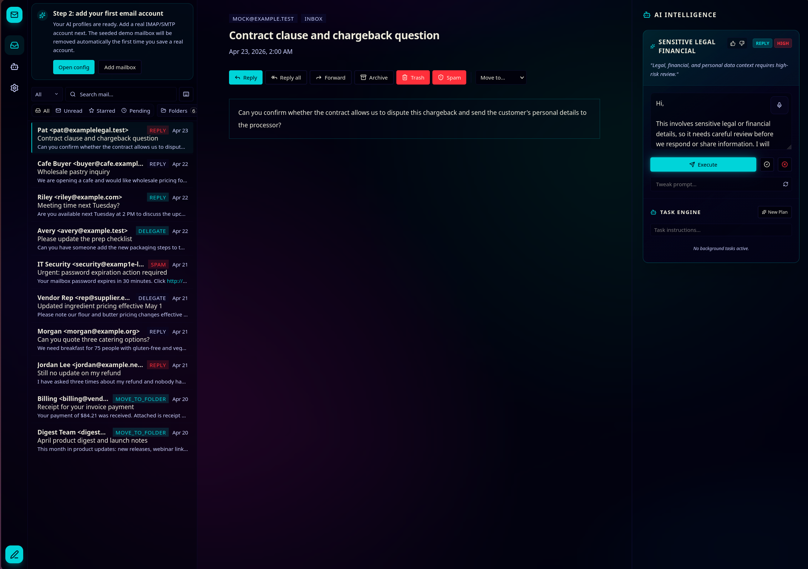

# Dear Robot



Dear Robot is a self-hosted, AI-first email client built for people who want fast mail handling without giving up control. It keeps the core mechanics inspectable: SQLite for state, SvelteKit for the app, server-side secrets for credentials, and explicit review before anything destructive or external happens.

At a glance, Dear Robot gives you:

- Multi-account IMAP and SMTP email handling
- Review-first AI suggestions for replies, triage, and task planning
- A fast inbox UI with folder navigation, bulk actions, search, and conversation view
- Drafts, compose, reply, reply all, forward, attachments, and offline-ish compose persistence
- A built-in MCP endpoint for external agent tooling
- Optional Obsidian vault integration for durable notes and agent memory
- A single Docker container with a single SQLite database file

## Core Features

- Self-hosted email client with IMAP and SMTP support
- Folder actions for archive, spam, trash, sent, drafts, and provider-specific folder mapping
- AI-assisted triage and response drafting
- Explicit approve/execute lifecycle for agent tasks
- Contact autocomplete from real usage and import/export flows
- Persistent drafts and action/audit logs
- PWA support for a more app-like browser experience
- Optional Obsidian vault mount for long-lived notes and handoffs
- Optional live-provider test paths for IMAP, SMTP, and AI integrations
- Email-first browser automations that can collect dashboard reports and queue reviewed Farin uploads

## What It Is Good At

- Handling multiple mailboxes from one interface
- Keeping AI action visible and user-approved
- Giving you a durable local store for mail, memory, and automation history
- Running in a simple Docker deployment without external queues or extra services

## Limitations

- It is not a fully autonomous email autopilot. Send, move, delete, and task execution remain explicit actions.
- Delete means move to Trash when a Trash folder is available. Permanent deletion is intentionally not the default behavior.
- AI behavior depends on the providers you configure. If a provider is unreachable or misconfigured, the related feature will fail closed.
- IMAP is the primary sync path. Provider-specific behavior varies depending on IMAP flags, special-use folders, and IDLE support.
- Gmail requires the OAuth flow in the UI. Generic accounts require working IMAP and SMTP credentials.
- The Obsidian vault integration is optional. It only appears as a tool when the vault is mounted, readable, and enabled in Settings.
- The app expects one operator account model. It is not designed as a multi-tenant SaaS.
- Production requires persistent secrets. Do not rely on development defaults.

## Browser Automations and Farin Reports

Dear Robot can teach an agent a repeatable, multi-step dashboard task such as
signing in to DoorDash or Uber Eats, opening the latest report, and downloading
the CSV. Start from the email that requests the report: open it and choose
**Automate this report**. Dear Robot finds the links in that message, creates
the isolated server profile and recipe behind the scenes, and opens a guided
tab in the browser you are already using through the optional Dear Robot
Browser Bridge. Complete the login and report download there, then return to
the email and choose **Done — save automation**. The bridge is a small
Chrome/Firefox extension installed once from
[`static/browser-bridge/extension`](static/browser-bridge/extension); the
launcher explains the install in context.

Runs replay only allowlisted HTTP(S) URLs and store downloads beneath
`DATA_DIR/browser/downloads`. Review the downloaded file before approving the
separate Farin upload step in the generated workflow. Uploads are explicit and
approval-gated in workflows. The Farin tenant
CLI currently accepts JSON request bodies but does not expose a multipart file
upload command, so the app uses Farin's authenticated multipart upload endpoint
for the final file transfer (or its accounting automation secret endpoint when
configured). No iframe or shared default Chrome profile is used.

If the bridge is not installed, the launcher clearly labels the server-window
fallback. That fallback is useful for local development only: the headed
window appears on the machine running Dear Robot, not inside a remote browser.

The setup dialog can save an encrypted username and password on the server.
During recording, common username/email fields and password fields are saved
only as `username`/`password` references; the typed values never enter recipe
JSON. This lets a server-side replay renew an expired dashboard session. MFA,
CAPTCHA, and other interactive challenges still require a fresh headed login.

Browser automations are intentionally not a separate Operations setup screen.
After the email-first setup, the generated workflow appears with the other
reviewable workflows in **AI Operations**. Manage saved profiles, encrypted
credentials, recipes, and recent runs under **Settings -> Browser automations**;
configure the optional Farin destination under **Settings -> Agent Tools**. The
inbox flow remains the only place to create a browser automation.

Recipes can create a paused, dry-run **every 7d** workflow. Enable it only after
reviewing the generated steps; the browser collection and Farin upload remain
separate, inspectable actions.

For server-side replay (and the local-only fallback), install Chromium once:

```bash
npx playwright install chromium
```

Set `FARIN_API_KEY` and `FARIN_COMPANY_ID` in the server environment, or enter
them under **Settings -> Agent Tools**. Secrets are encrypted with
`ENCRYPTION_KEY` and are never serialized to the client.

## Cloudflare Worker Proxy (for VPS users)

If you are hosting Dear Robot on a VPS (like Hetzner, OVH, or AWS) and find that your IP is blocked by Google (Gemini) or other providers, you can use a Cloudflare Worker as a relay.

### 1. Deploy the Worker

We've provided a ready-to-use worker in `workers/proxy`.

1. Navigate to the worker directory: `cd workers/proxy`
2. Install dependencies: `npm install`
3. Login to Cloudflare: `npx wrangler login`
4. Deploy: `npx wrangler deploy`

Take note of your worker URL (e.g., `https://proxy.your-subdomain.workers.dev`).

### 2. Configure in Dear Robot

1. Go to **Settings -> AI & Model Registry**.
2. Find the profile you want to proxy (e.g., Fallback / Gemini).
3. Enable the **Cloudflare Worker Proxy** toggle.
4. Paste your worker URL into the **Proxy URL** field.
5. Click **Save Profile**.
6. Use **Test Connection** to verify that the relay is working.

## Realtime Gmail Sync (Google Cloud Pub/Sub Webhooks)

Unlike standard IMAP accounts which support instant push notifications via the `IDLE` command, Gmail's API relies on Google Cloud Pub/Sub to deliver real-time email notifications. If you connect a Gmail account via OAuth, it will default to a 5-minute polling fallback unless you configure Pub/Sub.

To enable instant real-time sync for Gmail:

1. **Set up a Topic:** In your [Google Cloud Console](https://console.cloud.google.com/cloudpubsub/topic/list), create a new Pub/Sub Topic (e.g., `dear-robot-gmail-sync`).
2. **Grant Permissions:** Give `gmail-api-push@system.gserviceaccount.com` the `Pub/Sub Publisher` role for your new topic.
3. **Create a Push Subscription:** Create a subscription for your topic. Set the Delivery Type to **Push**.
4. **Set the Endpoint URL:** Set the Endpoint URL to your Dear Robot instance's webhook route: `https://your-domain.com/api/webhooks/google`.
5. **Watch the Mailbox:** You must tell the Gmail API to start publishing to this topic. You can do this via the [Gmail API Watch method](https://developers.google.com/gmail/api/reference/rest/v1/users/watch) or by following the [Gmail Push Notification Guide](https://developers.google.com/gmail/api/guides/push).

Once configured, Google will instantly ping your webhook when an email arrives, and Dear Robot will immediately sync the inbox and broadcast the update to your connected browser via Server-Sent Events (SSE).

## Docker Deployment

The recommended deployment is the included Docker image or the bundled `docker-compose.yml`.

### Recommended setup

1. Create a persistent data directory on the host, or use a named Docker volume.
2. Create a `.env` file with the required runtime secrets.
3. Build and start the container.
4. Sign in, configure AI profiles, then add a mailbox.
5. If you want Obsidian support, mount `/obsidian` and enable it in Settings.

### Quick start with Docker Compose

```bash
docker compose up -d --build
```

Create `.env` manually using the template below before starting the container.

```env
NODE_ENV=production
PORT=3000
DATA_DIR=/data

APP_SESSION_SECRET=replace-with-a-long-random-string
APP_PASSWORD=replace-with-a-password
ENCRYPTION_KEY=32-byte-hex-or-other-long-random-secret
MCP_AUTH_TOKEN=replace-with-a-bearer-token

AI_PROVIDER=deepseek
AI_MODEL=deepseek-v4-flash
AI_BASE_URL=https://api.deepseek.com
AI_API_KEY=

AI_FALLBACK_PROVIDER=gemini
AI_FALLBACK_MODEL=gemini-2.5-flash
AI_FALLBACK_BASE_URL=https://generativelanguage.googleapis.com/v1beta/openai/
AI_FALLBACK_API_KEY=

AI_ADVANCED_PROVIDER=deepseek
AI_ADVANCED_MODEL=deepseek-v4-pro
AI_ADVANCED_BASE_URL=https://api.deepseek.com
AI_ADVANCED_API_KEY=

IMAP_HOST=
IMAP_PORT=993
IMAP_USERNAME=
IMAP_PASSWORD=

SMTP_HOST=
SMTP_PORT=465
SMTP_USERNAME=
SMTP_PASSWORD=
```

### Example `docker-compose.yml`

```yaml
services:
  dear-robot:
    build: .
    ports:
      - "3000:3000"
    env_file:
      - .env
    environment:
      DATA_DIR: /data
      PORT: 3000
    volumes:
      - dear-robot-data:/data
      - dear-robot-obsidian:/obsidian # optional, remove if you do not want Obsidian support

volumes:
  dear-robot-data:
  dear-robot-obsidian:
```

### Bare `docker run`

```bash
docker build -t dear-robot .
docker run -d \
  --name dear-robot \
  -p 3000:3000 \
  --env-file .env \
  -e DATA_DIR=/data \
  -v dear-robot-data:/data \
  -v dear-robot-obsidian:/obsidian \
  dear-robot
```

If you do not want Obsidian support, remove the `/obsidian` volume mount. The feature stays disabled unless you enable it in the UI.

### Persistent paths inside the container

- `/data` holds the SQLite database, memory files, backups, skills, and other runtime state.
- `/data/browser` holds isolated Playwright profiles and downloaded report files. Keep this volume private.
- `/obsidian` is the optional vault mount used by the Obsidian tool.

Do not set `DB_PATH` manually in production. The app derives it from `DATA_DIR`.

## First Run Checklist

1. Start the container.
2. Open the app in a browser.
3. Sign in with the password from `APP_PASSWORD`.
4. Go to Config -> AI Profiles and save the provider settings you want to use.
5. Add your mailbox account after AI profiles are configured.
6. If you want Obsidian access, enable the Obsidian tool in Settings -> Agent Tools and point it at the mounted vault path.

## Environment Variables

### Required in production

| Variable | Purpose |
| --- | --- |
| `APP_SESSION_SECRET` | Signs the session cookie and CSRF/session state. Use a long random value. |
| `APP_PASSWORD` | Password used for app login. |
| `ENCRYPTION_KEY` | Encrypts stored secrets such as mail and provider credentials. |
| `MCP_AUTH_TOKEN` | Protects the MCP endpoint from unauthenticated use. |
| `DATA_DIR` | Absolute path to the persistent runtime directory. |

### App runtime

| Variable | Default | Purpose |
| --- | --- | --- |
| `NODE_ENV` | `development` | Runtime mode. Must be `production` in a real deployment. |
| `PORT` | `3000` | Port the Node server listens on. |
| `DATA_DIR` | `/data` | Root directory for SQLite, memory, backups, and skills. Must be absolute. |
| `DB_PATH` | derived from `DATA_DIR` | Not meant to be set manually. The app derives the SQLite path automatically. |
| `BROWSER_HEADLESS` | `true` | Headless browser replay default. Recording always opens a headed window. |
| `BROWSER_MAX_RUNTIME_MS` | `180000` | Maximum navigation/action timeout for a browser run. |
| `BROWSER_MAX_DOWNLOAD_BYTES` | `31457280` | Maximum browser download and Farin upload size. |
| `FARIN_API_HOST` | `https://farin.app` | Farin tenant API origin (localhost HTTP is allowed for development). |
| `FARIN_API_KEY` | unset | Optional server bootstrap tenant API key. Prefer the encrypted UI setting. |
| `FARIN_COMPANY_ID` | unset | Farin company id paired with the tenant key/automation secret. |
| `FARIN_AUTOMATION_SECRET` | unset | Optional shared accounting automation secret used by the ingest endpoint. |

### AI profiles

| Variable | Default | Purpose |
| --- | --- | --- |
| `AI_PROVIDER` | `deepseek` | Primary AI provider preset. |
| `AI_MODEL` | `deepseek-v4-flash` | Primary AI model. |
| `AI_BASE_URL` | `https://api.deepseek.com` | Primary AI endpoint. |
| `AI_PROXY_URL` | unset | Optional Cloudflare Proxy URL for the primary profile. |
| `AI_API_KEY` | unset | Optional bootstrap API key for the primary profile. |
| `OPENAI_API_KEY` | unset | Optional OpenAI API key used when an OpenAI profile is selected and no profile key is saved. |
| `AI_FALLBACK_PROVIDER` | `gemini` | Fallback AI provider preset. |
| `AI_FALLBACK_MODEL` | `gemini-2.5-flash` | Fallback AI model. |
| `AI_FALLBACK_BASE_URL` | `https://generativelanguage.googleapis.com/v1beta/openai/` | Fallback AI endpoint. |
| `AI_FALLBACK_PROXY_URL` | unset | Optional Cloudflare Proxy URL for the fallback profile. |
| `AI_FALLBACK_API_KEY` | unset | Optional bootstrap API key for the fallback profile. |
| `AI_ADVANCED_PROVIDER` | `deepseek` | Advanced planner provider preset. |
| `AI_ADVANCED_MODEL` | `deepseek-v4-pro` | Advanced planner model. |
| `AI_ADVANCED_BASE_URL` | `AI_BASE_URL` or `https://api.deepseek.com` | Advanced planner endpoint. |
| `AI_ADVANCED_PROXY_URL` | unset | Optional Cloudflare Proxy URL for the advanced profile. |
| `AI_ADVANCED_API_KEY` | unset | Optional bootstrap API key for the advanced profile. |
| `AI_MAX_REPAIR_ATTEMPTS` | `1` | Number of JSON repair attempts before the AI call fails. |
| `DEBUG_AI` | `false` | Logs additional AI request and response data in development. |

### Mail transport

| Variable | Default | Purpose |
| --- | --- | --- |
| `IMAP_HOST` | unset | Optional live IMAP host used by integration tests and live account setup. |
| `IMAP_PORT` | `993` | IMAP port. |
| `IMAP_USERNAME` | unset | Optional IMAP username for live-provider testing. |
| `IMAP_PASSWORD` | unset | Optional IMAP password for live-provider testing. |
| `SMTP_HOST` | unset | Optional SMTP host used by live-provider testing. |
| `SMTP_PORT` | `465` | SMTP port. |
| `SMTP_USERNAME` | unset | Optional SMTP username for live-provider testing. |
| `SMTP_PASSWORD` | unset | Optional SMTP password for live-provider testing. |
| `MAILBOX_OP_MIN_INTERVAL_MS` | `120` | Minimum delay between mailbox operations. |
| `RUN_LIVE_PROVIDER_TESTS` | `false` | Enables live integration test flows that require real provider credentials. |
| `TEST_EMAIL_FROM` | unset | Optional test sender address. |
| `TEST_EMAIL_TO` | unset | Optional test recipient address. |

### Attachments and safety

| Variable | Default | Purpose |
| --- | --- | --- |
| `ATTACHMENT_MAX_BYTES` | `15728640` | Maximum attachment size in bytes. |
| `ATTACHMENT_SCAN_STRICT` | `false` | Fails closed when attachment scanning reports warnings. |
| `API_RATE_LIMIT_PER_MINUTE` | `180` | API request limit per minute. |

### Automation and backups

| Variable | Default | Purpose |
| --- | --- | --- |
| `AUTOPILOT_INTERVAL_MINUTES` | `15` | Polling interval for autopilot processing. |
| `BACKUP_RETENTION_DAYS` | `30` | How long backups are kept before cleanup. |
| `BACKUP_MAX_COUNT` | `30` | Maximum number of retained backups. |
| `ALLOW_DANGEROUS_DB_RESET` | `false` | Test-only override for destructive local reset paths. Do not use in production. |

## Obsidian Vault Setup

Obsidian support is optional and disabled by default.

### What it does

- Lets the agent search, read, write, and append notes inside a mounted vault
- Makes it practical to keep decisions, summaries, and handoff notes close to the app
- Exposes the vault as a built-in tool named `obsidian_vault`

### How to enable it

1. Mount a host directory or Docker volume to `/obsidian`.
2. Make sure the mounted path is readable and writable by the container user.
3. Open Settings -> Agent Tools.
4. Enable the Obsidian vault integration.
5. Confirm the vault path is set to the mounted path, usually `/obsidian`.

### Notes

- The vault path must be absolute.
- The mounted path must exist as a real directory.
- Symlink escapes are blocked inside the tool layer.
- If the vault is missing or not writable, the app will keep the tool disabled.

### Suggested vault usage

- Put concise daily logs in append mode.
- Keep final decisions and handoff notes as curated notes.
- Search the vault before asking the model to recreate context.

## Security Model

- Session and CSRF protection are server-side.
- API secrets stay on the server.
- AI tool usage is opt-in and review-first.
- Obsidian write actions require an enabled vault mount.
- Dangerous deletion is intentionally routed through Trash instead of permanent removal.

## Development

```bash
npm install
npm run dev
```

Useful checks before merging:

```bash
npm run check
npm run lint
npm run test:unit
npm run test:e2e
npm run build
```

## License

This project is licensed under the MIT License. See [LICENSE](./LICENSE).
